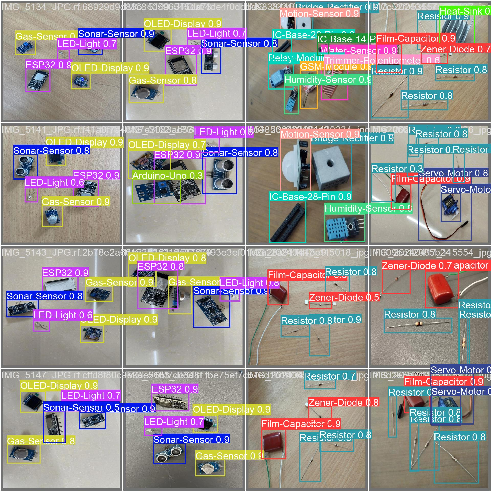

# ElectroCom61: A Multiclass Dataset for Detection of Electronic Components

<!DOCTYPE html>
<html lang="en">
<head>
    <meta charset="UTF-8">
    <meta http-equiv="X-UA-Compatible" content="IE=edge">
    <meta name="viewport" content="width=device-width, initial-scale=1.0">
</head>
<body>

<h2>Dataset Overview</h2>

We have introduced a multi-class object detection dataset for a range of electronic components coined as “ElectroCom61”. We have collected data from the Electronics Lab Support Room at the United International University (UIU), Dhaka, Bangladesh. To mimic real-world scenarios and enhance the robustness of models trained on this data, images were captured under varied lighting conditions, against diverse backgrounds, and multiple camera angles. The dataset is organized into 61 classes and contains a diverse collection of 2071 annotated images of electronic components. The images were randomly split into training, validation, and test images for training and testing the deep learning models. The images were preprocessed to enhance model training and performance. This dataset is a rich resource for developing advanced detection systems. It holds significant potential for educational and industrial applications, such as creating interactive learning tools, creating e-waste management systems, and streamlining inventory management processes in electronic manufacturing.

Pre-print: https://papers.ssrn.com/sol3/papers.cfm?abstract_id=4858132

<h2>Access the Dataset</h2>

Explore the ElectroCom61 dataset on Mendeley Data: <a href="https://data.mendeley.com/datasets/6scy6h8sjz/2" target="_blank">ElectroCom61</a>

<h2>Code</h2>

Here is a notebook called 'ElectroComp61_YOLO9' is used to train the model 'YOLOv9s' for mosquito detection with the ElectroCom61.

<h2>License</h2>

This dataset is available under <a href="LICENSE">LICENSE</a>. Please review the license before using the dataset for your projects.

<h2>Cite</h2>

If you use the ElectroCom61 dataset for your research, please cite it as follows:

<pre>
@dataset{faiyaz2024electrocom61,
  author       = {Md Faiyaz Abdullah Sayeedi and Anas Mohammad Ishfaqul Muktadir Osmani and Taimur Rahman and Jannatul Ferdous Deepti},
  title        = {{ElectroCom61: A Multiclass Dataset for Detection of Electronic Components}},
  year         = 2024,
  publisher    = {Mendeley Data},
  version      = {V2},
  doi          = {10.17632/6scy6h8sjz.2}
}
</pre>

<h2>Contact</h2>

For inquiries or feedback, feel free to contact us at msayeedi212049@bscse.uiu.ac.bd, aosmani203004@bscse.uiu.ac.bd, trahman221427@bscse.uiu.ac.bd

</body>
</html>
